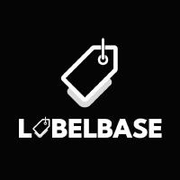

> [!WARNING]
> This repository was archived in favor of
> [`remcoros/labelbase-startos`](https://github.com/remcoros/labelbase-startos)

<p align="center">
  
</p>

# Labelbase for StartOS

[Labelbase](https://github.com/Labelbase/Labelbase) is a label management service for Bitcoin transactions and addresses.

Labelbase provides features for adding labels, importing and exporting labels, and offers a public API for integration with wallets and existing workflows.
This ensures that you always have access to the most up-to-date information.

Labelbase supports [BIP-329](https://bip329.org/), a format for unifying label data.

This repository creates the `s9pk` package that is installed to run `labelbase` on [StartOS](https://github.com/Start9Labs/start-os/).

## Dependencies

Install the system dependencies below to build this project by following the instructions in the provided links. You can find instructions on how to set up the appropriate build environment in the [Developer Docs](https://docs.start9.com/latest/developer-docs/packaging).

- [docker](https://docs.docker.com/get-docker)
- [docker-buildx](https://docs.docker.com/buildx/working-with-buildx/)
- [yq](https://mikefarah.gitbook.io/yq)
- [deno](https://deno.land/)
- [make](https://www.gnu.org/software/make/)
- [start-sdk](https://github.com/Start9Labs/start-os/tree/sdk/)

## Build environment

Prepare your StartOS build environment. In this example we are using Ubuntu 20.04.

1. Install docker

   ```bash
   curl -fsSL https://get.docker.com | bash
   sudo usermod -aG docker "$USER"
   exec sudo su -l $USER
   ```

2. Set buildx as the default builder

   ```bash
   docker buildx install
   docker buildx create --use
   ```

3. Enable cross-arch emulated builds in docker

   ```bash
   docker run --privileged --rm linuxkit/binfmt:v0.8
   ```

4. Install yq

   ```bash
   sudo snap install yq
   ```

5. Install deno

   ```bash
   sudo snap install deno
   ```

6. Install essentials build packages

   ```bash
   sudo apt-get install -y build-essential openssl libssl-dev libc6-dev clang libclang-dev ca-certificates
   ```

7. Install Rust

   ```bash
   curl https://sh.rustup.rs -sSf | sh
   # Choose nr 1 (default install)
   source $HOME/.cargo/env
   ```

8. Build and install start-sdk

   ```bash
   cd ~/ && git clone --recursive https://github.com/Start9Labs/start-os.git --branch sdk
   cd start-os/
   make sdk
   start-sdk init
   ```

Now you are ready to build the `labelbase` package!

## Cloning

Clone the project locally:

  ```bash
  git clone https://github.com/CasaVinteUM/labelbase-startos.git
  cd labelbase-startos
  git submodule update --init --recursive
  ```

## Building

To build the `labelbase` package for all platforms using start-sdk, run the following command:

```bash
make
```

To build the `labelbase` package for a single platform using start-sdk, run:

```bash
# for amd64
make x86
```

or

```bash
# for arm64
make arm
```

## Installing (on StartOS)

Run the following commands to determine successful install:

> :information_source: Change server-name.local to your Start9 server address

```bash
start-cli auth login
# Enter your StartOS password
start-cli --host https://server-name.local package install labelbase.s9pk
```

If you already have your `start-cli` config file setup with a default `host`, you can install simply by running:

```bash
make install
```

> **Tip:** You can also install the `labelbase.s9pk` using **Sideload Service** under the **System > Manage** section.

### Verify Install

Go to your StartOS Services page, select **Labelbase**, configure and start the service. Then, verify its interfaces are accessible.

**Done!**
